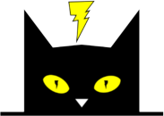

&nbsp;&nbsp;&nbsp;&nbsp;&nbsp;&nbsp; 

 

# Bubble Trouble: Quantifying the Effects of Bubbles on the Electrochemical Interface

## Abstract
The accumulation of electrochemically produced bubbles is inevitable in gas-evolving reactions and can induce potential losses by theoretically increasing activation, concentration, and ohmic overpotentials. These effects are often either neglected or overstated in the literature, which complicates the accurate analysis of experimental results for gas evolution reactions. This study systematically identifies and quantifies the overpotential losses induced by bubbles by combining experimental results for hydrogen (HER) and oxygen evolution reactions (OER), obtained using the rotating disk electrode (RDE) technique, with simulations based on a two-dimensional transmission line model. Our results show that ohmic overpotential is the primary cause of apparent activity loss due to bubbles in RDE, leading to catalyst activity misestimates exceeding two orders of magnitude, and Tafel slope errors of 100% at higher currents if uncorrected. By identifying these effects, this work provides a robust framework for mitigating inaccuracies and improving the characterization of electrocatalysts for gas evolution reactions.

## Videos
**01_Ir-poly_CV_1:** measurement of CV at 0-26% coverage

**02_Ir-poly_EIS_1:** measurement of EIS at 26% coverage 

**03_Ir-poly_CV_2:** measurement of CV at 26-38% coverage

**04_Ir-poly_EIS_2:** measurement of EIS at 38% coverage 

**05_Ir-poly_CV_3:** measurement of CV at 38-43% coverage

**06_Ir-poly_EIS_3:** measurement of EIS at 43% coverage

**07_Ir-poly_CV_4:** measurement of CV at 43-47% coverage

**08_Ir-poly_EIS_4:** measurement of EIS at 47% coverage

**09_Ir-poly_CV_5:** measurement of CV at 47-51% coverage

**10_Ir-poly_EIS_5:** measurement of EIS at 51% coverage
